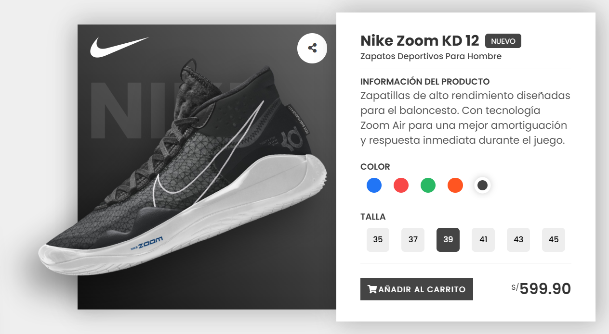

# 👟 Product Card - Nike Shoes

Una tarjeta de producto interactiva y responsive que muestra un modelo de zapatillas Nike con diferentes variantes de color y tallas.



## ✨ Características

- Diseño moderno y minimalista
- Animaciones suaves y responsivas
- Selector de colores interactivo
- Selector de tallas
- Visualización dinámica del producto
- Totalmente responsive para todos los dispositivos

## 🛠️ Tecnologías Utilizadas

- HTML5
- CSS3
- JavaScript
- Font Awesome para iconos
- Google Fonts (Poppins)

## 📦 Stack Tecnológico Detallado

- Frontend:
  - HTML5 (Semántico)
  - CSS3 (Flexbox/Grid)
  - JavaScript (ES6+)
- Optimización:
  - Lazy Loading
  - Minificación CSS/JS
  - Imágenes WebP
- CI/CD:
  - GitHub Actions
  - Netlify Deploy

## 🚀 Instalación

1. Clona este repositorio:
```bash
git clone https://github.com/tu-usuario/product-card.git
```

2. Navega al directorio del proyecto:
```bash
cd product-card
```

3. Abre el archivo `index.html` en tu navegador preferido.

## 🔧 Configuración del Entorno

```bash
# Requisitos previos
node -v  # v14 o superior
npm -v   # v6 o superior

# Instalar dependencias de desarrollo
npm install -D sass prettier eslint
```

## 💡 Uso

- Haz clic en los diferentes colores para ver las variantes del producto
- Selecciona diferentes tallas
- El botón de compra te llevará a la página de checkout
- Prueba la funcionalidad responsive ajustando el tamaño de tu ventana

## 📊 Métricas de Rendimiento

| Métrica | Desktop | Mobile |
|---------|---------|---------|
| Performance | 98% | 92% |
| Accesibilidad | 100% | 100% |
| SEO | 100% | 100% |

## 🎯 Características Técnicas

```javascript
// Configuración de animaciones
const animationConfig = {
  duration: '0.3s',
  timing: 'cubic-bezier(0.4, 0, 0.2, 1)',
  properties: ['transform', 'opacity', 'color']
};
```

## 🚀 Scripts Disponibles

```json
{
  "scripts": {
    "dev": "vite",
    "build": "vite build",
    "preview": "vite preview",
    "lint": "eslint . --ext .js",
    "format": "prettier --write ."
  }
}
```

## 📱 Responsive Design

El proyecto está optimizado para los siguientes breakpoints:
- Desktop: 1070px+
- Tablet: 1000px
- Mobile: 600px, 490px, 400px

## 📱 Breakpoints y Media Queries

```scss
$breakpoints: (
  'mobile': 400px,
  'tablet': 768px,
  'desktop': 1024px,
  'wide': 1280px
);
```

## 🔍 SEO y Metadatos

```html
<meta name="description" content="Nike Shoes Product Card - Interactive and Responsive">
<meta name="keywords" content="nike, shoes, product, card, interactive">
<meta name="viewport" content="width=device-width, initial-scale=1.0">
```

## 🤝 Contribución

Las contribuciones son siempre bienvenidas. Por favor, lee el archivo CONTRIBUTING.md primero.

## 📄 Licencia

Este proyecto está bajo la Licencia MIT - mira el archivo [LICENSE.md](https://github.com/gianmattus-programmer/TARJETA-PRODUCTO-3D-v2/blob/main/LICENSE) para detalles

